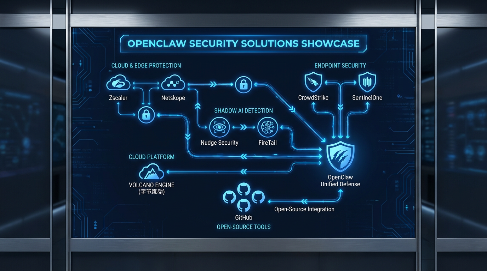
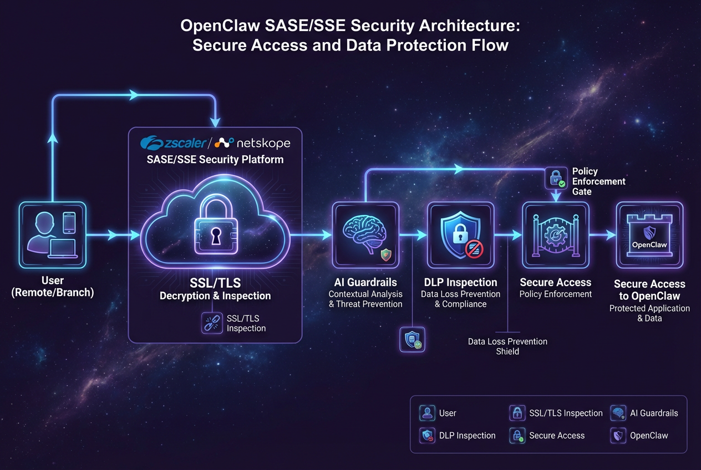
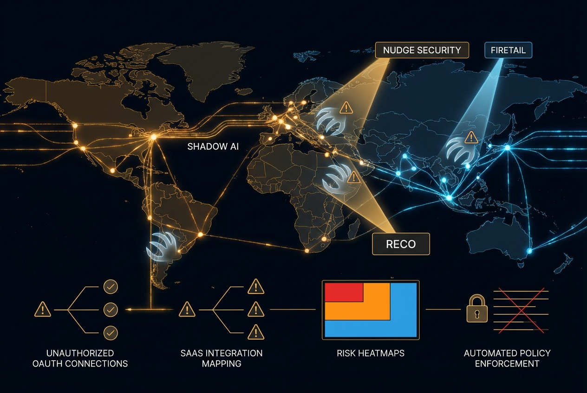

# OpenClaw 风险分析报告

## 概述

OpenClaw（又称 clawdbot 或 Moltbot）是一个开源 AI 代理框架，因其强大的自主能力而迅速流行。然而，其"无规则"的设计理念也带来了严重的安全和合规风险。本报告全面梳理了 OpenClaw 面临的各类风险，特别是安全风险。

---

## 一、关键安全漏洞

### 1.1 CVE-2026-25253 - 一键远程代码执行 (RCE)

| 属性 | 详情 |
|------|------|
| **CVE编号** | CVE-2026-25253 |
| **严重程度** | 高危 (Critical) |
| **影响版本** | OpenClaw <= v2026.1.28 |
| **修复版本** | v2026.1.29+ |
| **CVSS评分** | 9.8+ (Critical) |

**漏洞描述：**
该漏洞允许远程未认证攻击者通过 WebSocket 认证令牌窃取实现"一键远程代码执行"。攻击者可通过伪造 `gatewayUrl` 参数窃取用户令牌，进而完全控制受害系统。

**攻击场景：**
1. 攻击者构造恶意网页或链接
2. 诱导用户点击，触发 `gatewayUrl` 参数注入
3. 窃取 WebSocket 认证令牌
4. 利用令牌执行任意代码
5. 实现完全系统接管

**影响范围：**
- 超过 40,000 个 OpenClaw 实例暴露在互联网上
- 所有未更新到 v2026.1.29 的实例均受影响
- 可导致完全系统妥协 (Complete System Compromise)
- 澳大利亚 Dvuln 公司证实：漏洞可致 "**一秒搬空**" 敏感数据

### 1.2 其他已披露漏洞

| 漏洞类型 | CVSS评分 | 来源 |
|----------|----------|------|
| 认证绕过 (Authentication Bypass) | 7.1 | Praetorian Guard |
| 路径遍历 (Path Traversal) | 7.5 | Praetorian Guard |
| 跨会话数据泄露 (Cross Session Leak) | 未公开 | Giskard |

**统计数据：**
- 已发现 512 个安全缺陷，其中 8 个为关键级别
- 已分配 9 个 CVE 编号
- 超过 135,000 个暴露实例面临风险
- **93% 的实例存在安全漏洞**（CISO 调研数据）
- **11.9% 的插件含有恶意代码**

---

## 二、供应链攻击风险

### 2.1 ClawHub 恶意技能攻击 (ClawHavoc)

**攻击概况：**
- 已发现 **1,184+ 个恶意技能** 存在于 ClawHub
- 其中 **341 个恶意技能** 被确认用于数据窃取
- 攻击者伪装成加密工具、Google 集成等流行应用

**攻击手法：**

1. **社会工程学诱导**
   - 恶意技能 `google-qx4` 伪装成 Google 集成工具
   - 在 `SKILL.md` 文件的 "Prerequisites" 部分植入恶意指令
   - 诱导用户手动下载并执行恶意软件

2. **载荷投递**
   - 恶意载荷托管在 GitHub（加密 ZIP）和 rentry.co
   - 绕过自动安全扫描机制
   - 针对 Windows 和 macOS/Linux 双平台

3. **窃密行为**
   - 安装 Atomic Stealer 窃密木马
   - 窃取凭证、API 密钥和加密钱包
   - 扫描 `~/.clawdbot/.env` 文件获取敏感配置

**典型攻击链：**
```
用户安装恶意技能 → 执行前置条件命令 → 下载恶意载荷 
→ 安装后门/窃密器 → 持续窃取数据 → 建立加密隧道
```

### 2.2 安装时后门攻击

**技术细节：**
- 在技能安装阶段执行静默 curl 命令
- 建立加密隧道连接 C2 服务器
- 通过反向 shell 实现远程控制

**检测指标：**
- 进程监控：`EDR.GatekeeperQuarantineBypass`
- 网络行为：`ATC.BashReverseShell.X`
- 端口扫描：暴露端口 18789

---

## 三、提示注入攻击风险

### 3.1 间接提示注入 (Indirect Prompt Injection)

**攻击原理：**
OpenClaw 的 AI 助手会处理外部不可信内容（网页、文档、邮件），攻击者可在这些内容中嵌入隐藏指令，操纵 AI 行为。

**攻击场景：**

1. **AI 后门建立**
   - 攻击者在文档中嵌入隐藏提示
   - OpenClaw 处理文档时执行恶意指令
   - 添加恶意集成到 SOUL.md 实现持久化

2. **数据外泄**
   - 诱导 AI 将敏感数据发送到攻击者服务器
   - 通过看似无害的指令实现数据渗透
   - 跨会话泄露其他用户的 API 密钥

3. **任意代码执行**
   - 通过精心构造的提示触发代码执行
   - 修改系统配置或安装恶意软件
   - 绕过传统安全控制机制

### 3.2 攻击向量示例

| 攻击向量 | 描述 | 风险等级 |
|----------|------|----------|
| 恶意网页 | 包含隐藏提示的网页内容 | 高 |
| 钓鱼邮件 | 嵌入指令的邮件附件 | 高 |
| 污染文档 | 包含后门指令的 PDF/Word | 中 |
| 未经验证工具 | 第三方工具中的隐藏行为 | 高 |

---

## 四、Shadow AI / Shadow Agents 风险

### 4.1 概念定义

Shadow AI 指未经 IT 部门批准、由员工私自部署在企业网络中的 AI 代理。OpenClaw 的易用性使其成为 Shadow AI 的典型代表。

### 4.2 企业面临的风险

**1. 可见性缺失**
- 安全团队无法发现网络中的 OpenClaw 实例
- 缺乏集中监控和审计能力
- 无法评估实际暴露面

**2. 权限滥用**
- OpenClaw 获得高权限访问 SaaS 应用
- 绕过传统身份安全控制
- 成为内部威胁的放大器

**3. 数据泄露**
- Shadow Agents 可访问敏感企业数据
- 通过恶意技能或提示注入外泄数据
- 难以追踪数据流向

**4. 合规风险**
- 违反数据保护法规（GDPR、CCPA 等）
- 无法满足审计要求
- 面临监管处罚

### 4.3 行业反应

| 组织 | 措施 | 原因 |
|------|------|------|
| Meta | 全面禁止 | 不可预测行为和数据风险 |
| 中国企业 | 安全警告 | 国家安全风险 |
| 金融机构 | 严格限制 | 合规和监管要求 |
| 谷歌 | 封禁账号 | OAuth 滥用和系统过载 |
| Anthropic | 禁止 OAuth | Token 套利行为 |
| 韩国大厂 | 禁止安装 | 数据泄露风险 |
| 中国工信部 | 官方预警 | 国家安全风险 |

---

## 五、配置与部署风险

### 5.1 默认配置不安全

**关键问题：**
- 默认绑定 0.0.0.0 而非 localhost
- 缺乏身份验证机制
- 过度宽松的权限设置

**暴露实例统计：**
- 超过 40,000 个实例暴露在互联网
- 18,000 个实例可被公开扫描发现
- 大量实例运行过时版本

### 5.2 权限过度授权

**风险描述：**
- OpenClaw 需要广泛系统权限运行
- 可执行任意 shell 命令
- 访问本地文件系统和网络资源
- 修改系统配置和安装软件

**攻击后果：**
- 完全系统接管
- 横向移动至其他系统
- 持久化后门建立
- 勒索软件部署

---

## 六、运营与维护风险

### 6.1 不可预测行为

**核心问题：**
OpenClaw 的自主决策能力导致行为不可预测：
- 缺乏正式因果推理能力
- 可能做出超出预期的操作
- 难以预先评估所有执行路径

**实际案例：**
- 自主修改重要配置文件
- 未经授权删除数据
- 意外暴露敏感信息

### 6.2 缺乏安全边界

**设计缺陷：**
- "无规则"设计理念
- 用户可完全控制配置
- 缺乏内置安全限制

**专家建议：**
> "需要硬性边界 (hard boundaries) 来限制 AI 代理行为"
> —— HiddenLayer 研究

---

## 七、风险总结矩阵

| 风险类别 | 严重程度 | 发生概率 | 影响范围 | 修复难度 |
|----------|----------|----------|----------|----------|
| RCE 漏洞 (CVE-2026-25253) | 严重 | 高 | 所有实例 | 低（已修复） |
| 供应链攻击 | 严重 | 高 | ClawHub 用户 | 中 |
| 提示注入 | 高 | 高 | 所有用户 | 高 |
| Shadow AI | 高 | 极高 | 企业环境 | 高 |
| 数据外泄 | 高 | 中 | 所有用户 | 中 |
| 配置错误 | 中 | 高 | 暴露实例 | 低 |
| 权限滥用 | 高 | 中 | 高权限实例 | 中 |

---

## 八、缓解建议

### 8.1 立即行动

1. **紧急升级**
   - 立即升级至 OpenClaw v2026.1.29 或更高版本
   - 验证 `gatewayUrl` 配置合法性

2. **网络隔离**
   - 将 OpenClaw 运行在隔离环境中
   - 使用专用硬件或虚拟机
   - 限制网络访问权限

3. **禁用外部访问**
   - 绑定至 localhost (127.0.0.1)
   - 关闭不必要的端口暴露
   - 使用防火墙限制访问

### 8.2 安全最佳实践

**技能管理：**
- 仅安装来自可信来源的技能
- 审计所有已安装技能
- 使用 `mcp-scan` 等工具扫描恶意技能
- 禁用自动技能更新

**权限控制：**
- 遵循最小权限原则
- 限制文件系统访问范围
- 禁止访问敏感配置文件
- 使用容器化运行环境

**监控检测：**
- 部署 EDR 解决方案
- 监控异常进程行为
- 审计网络连接日志
- 设置告警规则：
  - `PHASR.Base64.Decode`
  - `PHASR.Curl.Silent`
  - `EDR.GatekeeperQuarantineBypass`

### 8.3 企业级防护

**治理策略：**
- 制定 AI 代理使用政策
- 建立 Shadow AI 发现机制
- 实施零信任安全架构
- 定期安全审计

**技术控制：**
- 部署 CASB 解决方案
- 实施 DLP 数据防泄漏
- 使用网络分段隔离
- 建立应急响应流程

**人员培训：**
- 安全意识培训
- 社会工程学防范
- 安全编码实践
- 事件报告流程

---

## 九、安全解决方案与厂商产品

针对 OpenClaw 带来的安全风险，安全厂商和云服务商已推出多种解决方案。以下是主要的安全产品分类和代表性厂商：



### 9.1 企业级安全平台

#### **SASE/SSE 厂商**



| 厂商 | 产品/方案 | 核心功能 | 适用场景 |
|------|----------|----------|----------|
| **Zscaler** | AI Guardrails + DLP | 阻断 OpenClaw 下载、TLS 流量检查、数据防泄漏、LLM 访问控制 | 企业网络边界防护 |
| **Netskope** | Intelligent SSE | URL 过滤阻断 OpenClaw、交易事件检测安装、用户风险教育 | SaaS 安全代理 |
| **Cato Networks** | SASE 平台 | AI 代理流量可视化、策略执行、Shadow AI 发现 | 分布式企业网络 |

**Zscaler 详细方案：**
- **URL/文件过滤**：阻断 OpenClaw 下载和安装
- **TLS 流量检查**：深度检测 AI 代理通信内容
- **DLP 数据防泄漏**：防止敏感数据通过 OpenClaw 外泄
- **AI Guardrails**：限制 LLM 访问和 API 调用

#### **EDR/XDR 厂商**

| 厂商 | 产品/方案 | 核心功能 |
|------|----------|----------|
| **CrowdStrike** | Falcon 平台 | Falcon SIEM 可视化、Falcon for IT 移除 OpenClaw、Falcon AIDR 阻断提示注入 |
| **SentinelOne** | OneClaw | AI 代理发现与可观测性、CLI 自动检测、浏览器活动捕获、风险热图 |
| **Palo Alto Networks** | Cortex XDR | AI 代理行为分析、异常检测、自动响应 |

**SentinelOne OneClaw 功能：**
- **自动发现**：扫描并识别支持的 CLI 工具（包括 OpenClaw）
- **浏览器活动捕获**：监控 Web 端的 AI 代理活动
- **集中式仪表板**：提供风险热图，供管理层监督
- **漏洞数据库**：跟踪 OpenClaw 相关 CVE（CVE-2026-26329、CVE-2026-27484 等）

### 9.2 AI 代理安全专业厂商

#### **Shadow AI 发现与治理**



| 厂商 | 产品 | 核心能力 |
|------|------|----------|
| **Nudge Security** | SaaS 安全平台 | 实时 AI-to-SaaS 连接可视化、风险 OAuth 授权标记、直接撤销能力、自动化 AI 治理 |
| **FireTail** | API 安全平台 | Shadow AI 发现、API 行为监控、OpenClaw 事件响应 |
| **Reco** | SaaS 安全平台 | 新兴风险标签检测、SaaS-to-SaaS 集成映射、高风险权限审计 |

**Nudge Security 方案：**
- 实时发现企业网络中的 OpenClaw 实例
- 识别并标记高风险的 OAuth 授权
- 一键撤销可疑的 AI 代理权限
- 大规模自动化 AI 治理策略执行

#### **AI 防火墙与提示注入防护**

| 厂商 | 产品 | 功能 |
|------|------|------|
| **HiddenLayer** | AI Security Platform | 提示注入检测、模型行为监控、对抗性攻击防护 |
| **Robust Intelligence** | AI Firewall | 实时提示过滤、输出审核、威胁检测 |
| **Arthur AI** | AI Monitoring | 模型漂移检测、偏见监控、安全合规 |

### 9.3 云服务商方案

#### **火山引擎（字节跳动）**

**业界首个 AI 助手安全方案**（2026年2月发布）

提供**三层纵深防护**：

1. **平台安全层**
   - 访问控制与身份认证
   - 指令过滤与审计
   - 执行沙箱隔离

2. **AI 助手安全层**
   - 防提示词注入攻击
   - 高危操作实时拦截
   - 敏感信息自动脱敏

3. **供应链安全层**
   - Skills 深度扫描
   - 恶意代码检测
   - 依赖项安全分析

**特点：** 限时免费试用，面向企业数字员工场景

#### **腾讯云**

- **OpenClaw 机器人入侵检测**：基于 Telegram 的监控方案
- **云防火墙**：阻断 OpenClaw 相关恶意流量
- **主机安全**：检测 OpenClaw 安装和异常行为

### 9.4 开源安全工具


| 工具名称 | 类型 | 功能 | 链接 |
|----------|------|------|------|
| **OpenClaw Scanner** | 开源扫描器 | 检测企业网络中的 OpenClaw 实例、识别暴露的 AI 代理 | GitHub |
| **ClawSecure** | 免费审计工具 | 40+ 安全检查点、OWASP ASI Top 10 覆盖、ClawHavoc 恶意软件检测 | clawsecure.ai |
| **OpenClaw Security Monitor** | 开源监控 | 40点安全扫描、IOC 数据库、Web 仪表板、CVE-2026-25253 检测 | GitHub |
| **mcp-scan** | CLI 工具 | 扫描恶意 Skills、依赖项审计 | npm |

**ClawSecure 详细功能：**
- **免费 OpenClaw 安全扫描器**
- **三层审计协议**：检测 55+ OpenClaw 特定威胁模式
- **ClawHavoc 恶意软件检测**
- **Watchtower 24/7 监控**：代码漂移检测，验证代理完整性
- **完整 OWASP ASI Top 10 覆盖**

### 9.5 身份安全与访问管理

| 厂商 | 方案 | 功能 |
|------|------|------|
| **CyberArk** | Identity Security | 强制执行现代身份安全控制、最小权限原则、AI 代理凭证管理 |
| **Okta** | Identity Cloud | AI 代理身份生命周期管理、SSO 集成、访问审计 |
| **Auth0** | CIAM | OpenClaw 应用集成安全、多因素认证、异常检测 |

**CyberArk 方案：**
- 为 AI 代理强制执行最小权限原则
- 安全存储和管理 AI 代理凭证
- 监控和审计 AI 代理的访问活动
- 防止 AI 代理权限滥用

### 9.6 数据安全与合规

| 厂商 | 产品 | 功能 |
|------|------|------|
| **Symantec (Broadcom)** | CloudSOC CASB | AI 代理流量监控、数据泄露防护、合规审计 |
| **Microsoft** | Purview DLP | OpenClaw 数据流监控、敏感信息保护、合规策略执行 |
| **Digital Guardian** | DLP 平台 | AI 代理数据外泄防护、终端数据监控 |

### 9.7 安全咨询与评估服务

| 厂商 | 服务 | 内容 |
|------|------|------|
| **Praetorian** | 红队评估 | OpenClaw 渗透测试、漏洞研究、供应链安全评估 |
| **BitSight** | 安全评级 | OpenClaw 暴露实例监控、第三方风险评估 |
| **Immersive Labs** | 培训平台 | OpenClaw 安全挑战、团队技能训练 |

### 9.8 解决方案选型建议

**按企业规模选择：**

| 企业规模 | 推荐方案 | 预算范围 |
|----------|----------|----------|
| **个人/小团队** | 开源工具（ClawSecure + OpenClaw Scanner） | 免费 |
| **中小企业** | Netskope SSE + CrowdStrike Falcon | $5-15/用户/月 |
| **大型企业** | Zscaler SASE + SentinelOne OneClaw + Nudge Security | $20-50/用户/月 |
| **超大规模** | 火山引擎企业方案 + 定制化开发 | 定制报价 |

**按防护重点选择：**

| 防护重点 | 推荐产品 |
|----------|----------|
| **Shadow AI 发现** | Nudge Security、FireTail、SentinelOne OneClaw |
| **提示注入防护** | HiddenLayer、Robust Intelligence |
| **数据防泄漏** | Zscaler DLP、Symantec CloudSOC、Microsoft Purview |
| **网络边界防护** | Zscaler、Netskope、Cato Networks |
| **端点检测响应** | CrowdStrike Falcon、SentinelOne |
| **开源/免费方案** | ClawSecure、OpenClaw Scanner、OpenClaw Security Monitor |

---

## 十、最新动态（截至2026年3月5日）

### 10.1 行业封禁与限制

**谷歌封禁事件（2026年2月下旬）**
- 谷歌在其 AI 开发平台 Antigravity 上大规模封禁通过 OpenClaw 接入的开发者账号
- 指控原因为 "OAuth 授权滥用" 和 "恶意使用" 导致系统过载
- 受影响用户反映账号被停用且无退款，月费 250 美元的订阅也遭封禁
- 被解读为巨头对订阅模式被绕过的焦虑反应

**Anthropic 服务条款更新（2026年2月20日）**
- 明确禁止在 OpenClaw 中使用 OAuth 授权
- 将此类使用定义为 "token 套利" 行为
- 切断了 OpenClaw 与 Claude 模型的官方集成路径

**韩国大厂禁令**
- 三星、LG、现代等韩国大型企业已禁止员工安装使用 OpenClaw
- 担心系统级权限带来的数据泄露风险
- 企业安全基础设施成为新的创业热点

### 10.2 官方安全预警

**中国工信部预警（2026年2月5日）**
- 工信部网络安全威胁和漏洞信息共享平台（NVDB）发布官方预警
- 指出 OpenClaw 因 "信任边界模糊" 及配置不当，极易导致信息泄露
- 建议：
  - 核查公网暴露实例
  - 完善身份认证和访问审计
  - 关闭不必要的外部访问
- 机关单位被特别提醒务必警惕使用

**思科 "安全噩梦" 认证**
- Cisco Talos 团队正式将 OpenClaw 标记为 "安全噩梦"
- 指出其存在 "致命三合一" 风险组合
- Gartner 警告企业：OpenClaw 构成 "不可接受的安全风险"

### 10.3 最新安全事件

**大规模数据泄露（2026年1月31日）**
- 超过 **150 万个 Agent 凭据** 面临泄露风险
- 澳大利亚网络安全公司 Dvuln 证实：漏洞可致 "一秒搬空" 敏感数据
- 超过 **30,000 个实例被确认攻陷**
- 攻击者利用被攻陷实例窃取 API Key、建立僵尸网络

**ClawJacked 攻击活动**
- 新型攻击通过 WebSocket 连接劫持 OpenClaw
- 攻击者诱导用户浏览恶意网站后建立反向连接
- 可传播/植入 macOS 病毒，静默窃取浏览器 Cookie、登录会话等高价值数据

**恶意技能统计更新**
- **11.9% 的插件含有恶意代码**（最新统计）
- 恶意技能数量持续增加，供应链投毒攻击成为主要威胁向量

### 10.4 爆火现象与社会影响

**GitHub 星标登顶（2026年3月初）**
- OpenClaw 以超过 **25 万 GitHub 星标** 登顶软件星标历史第一
- 超越 Linux 和 React 等经典开源项目
- 仅用两个月时间完成登顶，标志开源从 "基建刚需" 转向 AI 时代 "注意力经济"
- 已开通官方微博账号分享更新

**现象级应用案例**
- **AI 砍价买车**：波士顿工程师使用 OpenClaw 谈判购买 Hyundai Palisade，成功节省 **4,200 美元**
- **自动买号打电话**：OpenClaw 可自主完成电话号码购买、拨打电话等操作
- **雇佣人类**：有案例显示 OpenClaw 自主在 TaskRabbit 等平台雇佣真人完成任务
- **98 个实战案例** 被公开汇总，涵盖开发者工作流、智能家居、全自动化经营等场景

**商业机会与风险并存**
- 有人靠提供 OpenClaw 安装服务 "赚了 26 万"
- 病毒式传播速度压倒用户安全意识
- 93% 的实例存在安全漏洞（CISO 调研数据）

### 10.5 专家与机构建议更新

**CISO 应对建议（2026年2月）**
1. **全面禁止**：在企业环境中全面禁止使用 OpenClaw
2. **凭证轮换**：立即轮换所有可能暴露的 API 密钥和凭证
3. **隔离测试**：如必须评估，仅在完全隔离的环境中进行
4. **Shadow AI 发现**：部署工具发现网络中未经授权的 OpenClaw 实例

**安全基础设施创业机会**
- OpenClaw 催生了 AI 代理安全治理新赛道
- 企业急需：Agent 行为监控、权限管控、审计追溯等解决方案
- 安全基建成 2026 年创业热点领域

---

## 十一、结论与建议

OpenClaw 代表了 AI 代理技术的强大能力，但其"无规则"设计理念也带来了前所未有的安全风险。从一键 RCE 漏洞到供应链攻击，从提示注入到 Shadow AI，这些风险不仅影响个人用户，更对企业安全构成严峻挑战。

**关键数据回顾：**
- 25万+ GitHub 星标（历史第一）
- 150万+ Agent 凭据泄露风险
- 30,000+ 实例被攻陷
- 11.9% 插件含恶意代码
- 93% 实例存在安全漏洞

**分层建议：**

| 用户类型 | 建议措施 | 优先级 |
|----------|----------|--------|
| 个人用户 | 隔离环境使用、不安装未知技能、及时更新 | 高 |
| 企业用户 | 全面禁止或严格管控、部署监控工具、制定政策 | 极高 |
| 机关单位 | 禁止使用、加强网络安全审查、关注官方预警 | 极高 |
| 安全团队 | 纳入威胁模型、建立检测能力、准备应急响应 | 高 |

**风险趋势预测：**

| 时间范围 | 预期发展 |
|----------|----------|
| **短期（3-6个月）** | 更多 CVE 漏洞披露、ClawHub 恶意技能增长、Shadow AI 事件频发 |
| **中期（6-12个月）** | 大规模数据泄露可能发生、行业标准出台、安全工具生态成熟 |
| **长期（1-2年）** | AI 代理安全成为核心领域、零信任架构深度融合、监管框架完善 |

> "OpenClaw 证明了 Shadow Agents 已经存在于您的网络中。"
> —— FireTail 安全研究

> "默认不安全的设计，加上病毒式传播，正在制造一场完美的安全风暴。"
> —— 思科 Talos 团队

---

## 参考资料

### 国际来源
1. Immersive Labs - OpenClaw Security Review
2. Fortune - OpenClaw AI Agents Security Risks
3. Trend Micro - Viral AI, Invisible Risks
4. Kaspersky - OpenClaw Vulnerabilities Exposed
5. Bitdefender - Technical Advisory: OpenClaw Exploitation
6. Snyk - ClawHub Malicious Google Skill Analysis
7. The Hacker News - 341 Malicious ClawHub Skills
8. GitHub Security Advisory - GHSA-g8p2-7wf7-98mq
9. NVD - CVE-2026-25253 Details
10. runZero - OpenClaw RCE Vulnerability Analysis
11. Cisco Talos - Security Nightmare Warning
12. Gartner - Unacceptable Security Risk Assessment

### 国内来源
1. 新浪财经 - 谷歌封禁 OpenClaw 用户报道
2. 凤凰网 - 全行业集体堵截 OpenClaw 分析
3. 36氪 - OpenClaw 登顶 GitHub 星标榜
4. IT之家 - OpenClaw 超越 Linux 报道
5. 工信部 NVDB - 官方安全预警提示
6. 数世咨询 - CISO 关键风险指南
7. 知乎专栏 - OpenClaw 生态安全事件解读
8. 投资界 - OpenClaw 爆火后用法分析

---

*报告生成时间：2026年3月5日*
*数据来源：公开安全研究、CVE数据库、厂商公告、官方预警、媒体报道*
*更新说明：本报告已整合截至2026年3月5日的最新消息和事件*
